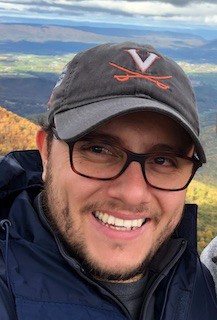

```{r setup, include=FALSE}
knitr::opts_chunk$set(echo = FALSE)
```


```{r out.width='150px', fig.align='center', echo=FALSE}

```

Hello there!! Thank you for visiting my page. A little bit about me, my name is Nelson Barrientos; I was born in El Salvador but have been living in the United States since 2010. I'm a very outgoing person who enjoys many things in life. I like watching sports, especially soccer. I'm a big Real Madrid fan. I also like to do outdoor activities such as hiking, biking, and kayaking. I'm also a big fan of Marvel and Star Wars movies. 

I'm currently a Human Genetics PhD student at the Johns Hopkins University School of Medicine. Before coming to Baltimore, I went to school for undergrad and grad school at the University of Virginia (Go Hoos!!) and lived in Charlottesville, VA for about 7 years. 

I hope to update this website with many more things, including my research projects, publications, talks, etc. in the future.